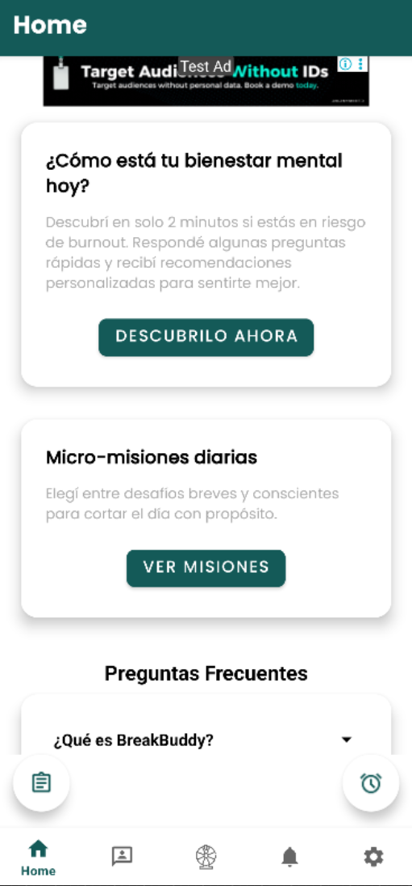
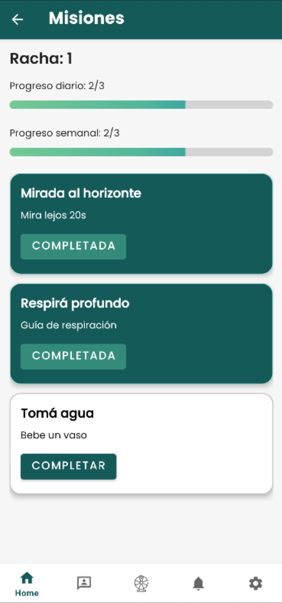
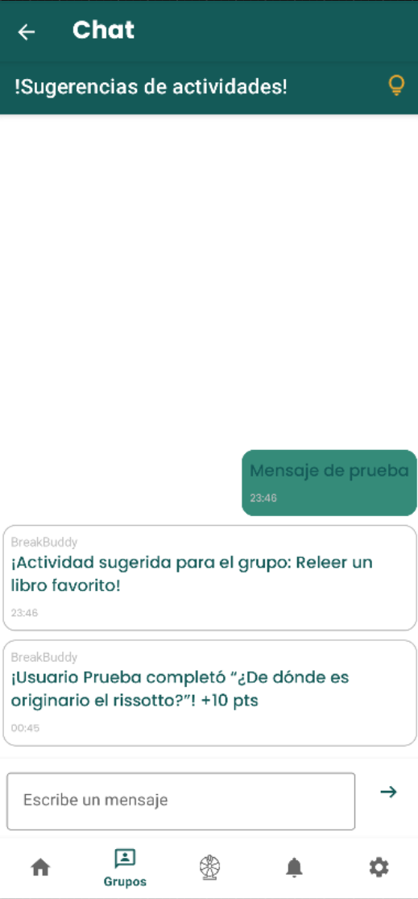
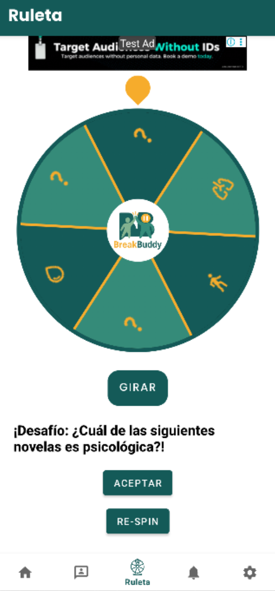
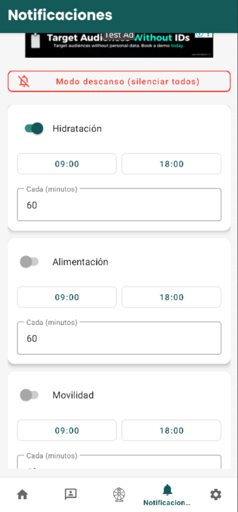

# BreakBuddy — Android App

Android application developed as a team project to support active breaks, social interaction, and well-being within organizations.

Users can authenticate, manage their profile, participate in groups, complete check-ins and activities, communicate through chat, and receive notifications.

## Screenshots

Selected screens from a development build show onboarding, the home dashboard, daily missions, group chat, gamified challenges, and configurable reminders. Click any image to view it at full resolution.

<table>
  <tr>
    <th>Welcome &amp; Sign-in</th>
    <th>Home Dashboard</th>
    <th>Daily Missions</th>
  </tr>
  <tr>
    <td align="center"><a href="docs/screenshots/welcome.webp"></a></td>
    <td align="center"><a href="docs/screenshots/home.webp"></a></td>
    <td align="center"><a href="docs/screenshots/missions.webp"></a></td>
  </tr>
  <tr>
    <th>Group Chat</th>
    <th>Challenge Wheel</th>
    <th>Reminders</th>
  </tr>
  <tr>
    <td align="center"><a href="docs/screenshots/group-chat.webp"></a></td>
    <td align="center"><a href="docs/screenshots/challenge-wheel.webp"></a></td>
    <td align="center"><a href="docs/screenshots/reminders.webp"></a></td>
  </tr>
</table>

## Features

- User registration and login
- Google Sign-In
- Profile and interest management
- Group creation and membership
- Group administration
- Group chat
- Check-ins and activities
- Missions and engagement mechanics
- Push notifications
- Organization and user management
- Firebase-backed data synchronization

## Tech Stack

- Kotlin
- Android SDK
- AndroidX
- ViewModel
- LiveData
- Jetpack Navigation
- View Binding
- Firebase Authentication
- Cloud Firestore
- Firebase Cloud Messaging
- Google Sign-In
- Gradle

## Architecture

Data-access logic is organized through repositories for users, groups, and organizations.

The UI uses ViewModels and AndroidX components to manage application state and navigation.

Firebase provides authentication, persistence, synchronization, and push-notification services.

## Requirements

- Android Studio
- JDK 11
- Android SDK 35
- Android 7.0 / API 24 or newer

## Setup

Clone the repository and open it in Android Studio.

Configure a compatible Firebase project and add:

```text
app/google-services.json
```

Then synchronize the Gradle dependencies.

Build the debug application with:

```bash
./gradlew assembleDebug
```

On Windows:

```bash
gradlew.bat assembleDebug
```
